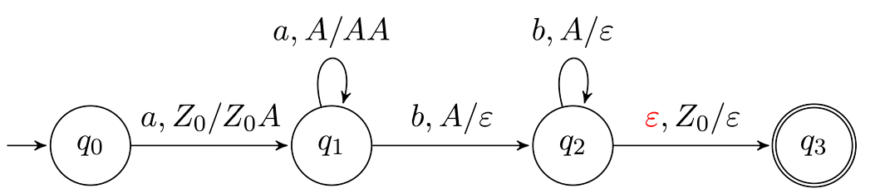
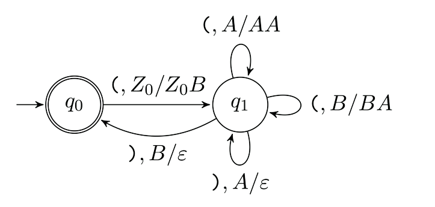
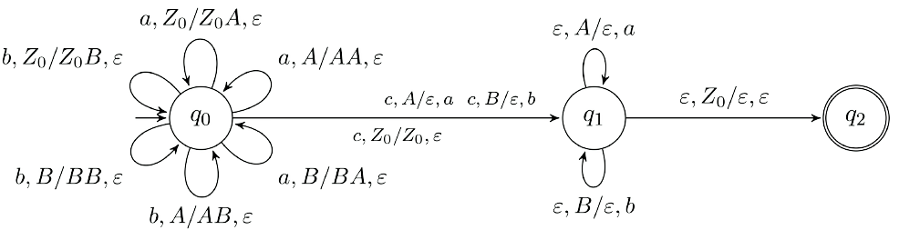

## Appunti di API. AA 2021/2022

# Modelli e linguaggi
## I Modelli
**Progettazione basata su modelli:**

La fase di progettazione di un artefatto complesso di basa sull'uso di *modelli*. Il modello consente di focalizzarsi sugli aspetti principali del problema e permette di effettuare delle verifiche preliminari sul funzionamento.

**Modelli formali e il loro uso:**

effettuare una formalizzazione di un problema significa ottenere una descrizione astratta dell'entità reale del problema.
dopo la formalizzazione del problema chiaramente va trovata una soluzione ad esso e per concludere bisogna interpretare i risultati alla luce del modello, nel contesto dell'entità reale &rarr; (ri)valutazione delle scelte di progetto.
Un modello viene detto *adeguato* se riflette con correttezza e precisione il fenomeno modellato per gli aspetti interessati.

**Modelli dell'informatica:**

l'informatica è una delle discipline dove vi è presente una grande vicinanza tra il modello e la realtà di cui si occupa (In questo caso il calcolo)
Nella sua evoluzione i primi calcolatori sono stati la materializzazione diretta del modello di calcolo.

**Applicazioni dell'informatica:**

L'informatica viene applicata in svariati contesti &rarr; un particolare calcolo è il modello di qualcosa di reale.
Il successo è determinato dalla flessibilità del calcolo astratto come modello di una sequenza di ragionamenti logici; spesso la difficolà sta proprio del *formulare* il modello (definire il problema).

## I linguaggi
Il linguaggio è da sempre uno strumento utilizzato per esprimere modelli.

### Gli elementi che compongono un linguaggio

**L'alfabeto:**

Un linguaggio è, per definizione, sempre definito su un *alfabeto*.
L'alfabeto è un insieme finito di simboli di qualsiasi tipo.
esempi:
* *{a,b,c,d,....,z}*
* *{0,1}*
* *Codice Morse, Baudot, ASCII ecc.*  

**Stringa di un alfabeto arbitrario A:**

Una stringa è una sequenza ordinata e finita di elementi dell'alfabeto.
La lunghezza di una stringa è, come ci si può immaginare, il numero di caratteri che la compongono &rarr; |a| = 1, |stringa| = 7.  
Inoltre, a prescindere dall'alfabeto utilizzato, è presente anche la stringa nulla **ε** &rarr; |ε| = 0.  
A* è invece l'insieme di tutte le stringhe (incluse quella nulla) su A.
 * *Esempio:* A = {0,1}, A* = {ε,0,1,00,01,10,11,100...}

**Operazioni sulle stringhe:**  

Concatenazione &rarr; operazione che concatena due stringhe
  *Esempio:* x = Bana, y = na &rarr; x.y = Banana

**Monoide libero:**

Dato un alfabeto arbitrario A &rarr; **(A* , .)** è il *monoide libero* costruito su A, l'elemento neutro di questo monoide è ε.  

**Il Linguaggio:**

Un linguaggio **L** su un alfabeto **A** è un sottoinsieme di **A*** ovvero un insieme di parole di A.
*esempi:*  
* *l'italiano è un linguaggio su A = {a,b,c,d,e,...}*
* *I files pdf sono un linguaggio su A = {0,1}*
* *Il DNA è un linguaggio codificabile su A = {C,G,A,T}*
* *I numeri pari in base 4 sono un linguaggio su A = {0,1,2,3}*  
**NOTA BENE:** anche se |A| < ∞, non necessariamente si avrà che |L| < ∞ (vedi ultimo esempio).

## Operazioni tra linguaggi

Un dato linguaggio L è a tutti gli effetti un insieme, di conseguenza valgono l'Unione ∪, l'intersezione ∩ e la differenza \ .  
Il complemento ¬L è definito come A*\L  

**Concatenazione tra linguaggi:**  

Dati L1 su A1 e L2 su A2 &rarr; L1.L2 definito su A1 ∪ A2 è:  
L1.L2 = {x.y | x ∈ L1, y ∈ L2}  

 *esempio:* &rarr; Dati L1 = {0,1}*, L2 = {a,b}* abbiamo che:  
 * L1.L2 = {ε,0,1,0a,011b,0aba,...}   
 **NOTA BENE:** la stringa a1 **non fa parte** di  L1.L2.
                   
**Alcune proprietà:**

* Ln, n ∈ N, è la concatenazione di L con sè stesso *n* volte.   
**NOTA BENE:** Il lunguaggio vuoto L1 = ∅ ≠ {ε} = L2  

**Operatore +**

L'operatore **+** indica le stringhe fatte concatenando uno o più elementi dell'insieme.
* A = {0,1}, A+ = {0,1,00,01,...}
* *Per estensione* &rarr; L* = U∞n=0  Ln  ,   L+ = U∞n=1  Ln,
                   
 **Il linguaggio come formalismo espressivo:**  
 
Un linguaggio può essere usato per esprimere un problema:
* trovare la miglior mossa successiva in una partita a scacchi  
* trovare tre numeri interi positivi tali per cui x3 + y3 = z3  

L'insieme delle soluzioni di un problema è un linguaggio  

* risolvere un problema &rarr; calcolare (riconoscere) un x ∈ L
* *esempio:*  "Questo programma C è sintatticamente corretto?" &rarr; Data x dire se x ∈ Llinguaggio c  

### Passare da un linguaggio all'altro

**traduzioni:**  

Tradurre &rarr; mettere in corrispondenza parole di due linguaggi.  
Formalmente, una traduzione è una mappa τ (·): L1 &rarr; L2  

* L1 = {a,b}* , L2 = {c,d}* , τ mappa a &rarr; c , b &rarr; d ,  τ(ba) = dc. 

# Automi a stati finiti 

## un semplice modello di calcolo  

* I modelli operazionali di calcolo vengono definiti come *macchine astratte*.  
* Esse modellano il calcolo come una serie di passaggi discreti tra uno stato precedente e uno successivo. 
* Le macchine più semplici sono gli **automi a stati finiti** (anche dette *finite state automata FSA*), esse hanno una memoria di calcolo formata da un insieme finito di stati
* *esempi:* {marce di un'auto}, {in partenza, in viaggio, arrivo}, {1,2,...,k}.  

## Formalizzazione 

**Costituenti di un FSA**  

* **Q** &rarr; l'insieme finito dei suoi stati.  
* **I** &rarr; l'insieme finito (alfatebo) dei simboli in ingresso.
* **δ: Q × I &rarr; Q** &rarr; la funzione di transizione: mappa una coppia (stato corrente e destinazione).  
* Serve definire un inizio della computazione: chiamiamo q0 ∈ **Q** lo stato iniziale del nostro automa. Esso viene indicato graficamente con una freccia entrante non generata da alcuno stato.  

## FSA riconoscitore  

**Riconoscere un linguaggio con un FSA**  

Possiamo utilizzare un FSA per riconoscere le parole di un linguaggio, definiamo l'insieme di stati finali **F ⊆ Q**.  
Se l'automa, leggendo una stringa, partendo da q0 termina in uno stato finale allora la stringa appartiene al linguaggio.  

**Formalizzazione dell'accettazione**

**Sequenza di mosse** &rarr; Formalizziamo una sequenza di mosse definendo **δ* : Q × I* &rarr; Q** estensione di δ, induttivamente:  
* Base: ∀q ∈ Q, δ*(q,ε) = q  
* Passo: δ*(q, y.i) = δ(δ*(q, y), i)  

**Accettazione di un linguaggio** &rarr; Possiamo formalizzare l'accettazione di un linguaggio L su I da parte di un FSA (Q, I, δ, q0, F) in questo modo:  x ∈ L ⇔ δ*(q0, x) ∈ F

## Formalizzazione di un traduttore  

**Elementi del traduttore**  

* Un FSA traduttore: 7-upla *A*: (Q, I, δ, q0, F, O, η)  
* ⟨Q, I, δ, q0, F⟩ come nell'FSA riconoscitore. 
* **O**: Alfabeto di uscita. 
* η : Q × I → O* Funzione di traduzione. 

**Funzione di traduzione per stringhe η***

* **η* : Q × I* → O*** Definita in maniera analoga  
Base η*(q,ε) = ε  
Passo η*(q, y.i) = η*(q, y).η(δ*(q, y), i)  

* L'intero calcolo di una traduzione è quindi formalizzato come:  τ(x) = η*(q0,x) ⇔ δ*(q0,x) ∈ **F**  

## Formalizzazione del comportamento ciclico   

**Pumping lemma**  
 
**Premessa** &rarr;  ∃x ∈ L, L riconosciuto da FSA, |x| > |Q|  
* Conseguenza &rarr; esistono q ∈ Q, w ∈ I+ tali che x = ywz con y, z  ∈ I* e δ*(q,w) = q  
ovvero esiste una sottostringa di x che viene riconosciuta dall’automa effettuando un’iterazione su un ciclo di stati. 
* Dal pumping lemma segue che ywnz ∈ L,  ∀n ≥ 0.

**Proprietà dei linguaggi riconosciuti da FSA**  

* Posso dire se L = ∅  
∃x ∈ L ⇒ ∃y ∈ L, |y| < |Q| &rarr; se una parola ha “cicli in riconoscimento” li elimino &rarr; posso dare in pasto le y all’FSA (sono finite) e verificare se almeno una ∈ L
* Posso dire se L = ∞  
∃x ∈ L, |Q| ≤ |x| < 2|Q| implica che x abbia un ciclo in riconoscimento. 

## Limitazioni degli FSA  

**Riconoscere le strutture a parentesi**

Domanda: L = {anbn | n ≥ 0} è riconosciuto da un FSA?  
intuizione: **NO**, dimostriamolo per assurdo. 

sia x ∈ L, x = ambm, m/2 > |Q|, applicando il pumping lemma abbiamo che x = ywz, con w che deve avere una di queste forme: 
* w = ak, pompando w ottengo ∀r ∈ N, am-kar·kbm ∈ L, **non va** 
* w = bk, pompando w ottengo ∀r ∈ N, amar·kbm-k ∈ L, **non va** 
* w = akbh, pompando w ottengo ∀r ∈ N, am-k(akbh)rbm-h ∈ L, **non va** 

**Verso modelli più potenti**  

* Intuitivamente: per “contare” un n arbitrariamente grande, occorre una quantità di memoria altrettanto grande. 
* Riconoscere strutture a parentesi (HTML,XML,linguaggi di programmazione) non è fattibile per un FSA. 
* Anche modellare un calcolatore fisico (che è un FSA) come tale può essere scomodo/intrattabile. 
* è necessario estendere gli FSA per riuscire a renderli più efficaci. 

## Il concetto di chiusura 

### Chiusura algebrica 

Dati un insieme S, ed un’operazione definita sui suoi elementi si dice che S è chiuso rispetto all’operazione, se il risultato di dell’applicarla ad un elemento di S è contenuto in S. 

### Chiusura nei linguaggi 

**chiusura di famiglie di linguaggi**  

* Famiglia di linguaggi: un insieme **L** i cui elementi sono linguaggi, **L** = {Li}  
* L è chiusa rispetto a un’operazione (binaria) ⋆ se ∀L1, L2 ∈ **L** vale L1 ⋆ L2 ∈ **L**  

**Linguaggi regolari**  

* La famiglia di linguaggi riconoscibili con un FSA è la famiglia dei linguaggi regolari, **R** o REG.  
* **R** è chiusa rispetto a ∪, ∩, ¬, \, alla concatenazione, a ∗ e +  

# Automi a pila  

## Aumentiamo la potenza di un FSA  

**Descrizione operativa dell'automa a pila**  

Un FSA ha un organo di controllo (OC) con memoria finita e un nastro di input infinito su cui non può scrivere.
Se l'automa a pila considerato è un traduttore, esso ha un nastro di output sul quale può solo scrivere.  
La "memoria" dello stato di calcolo è finita.  

**Una memoria estesa**  

Al concetto descritto prima aggiungiamo una memoria a impilamento:  
* Infinita
* Accesso alla sola cima  
* La lettura cancella  
* Funziona con metodo LIFO  

**Descrizione Operativa**  

L'automa a pila compie una mossa in funzione di:  
* simbolo letto dalla cima della pila. 
* stato corrente nell'FSA che costituisce l'organo di controllo. 
* Opzionalmente, simbolo letto dal nastro in ingresso  

L'automa a pila passa alla configurazione successiva:  
* Cambiando stato nell'OC.
* sostituendo al simbolo in cima allo stack una stringa α di simboli (potenzialmente α = ε)  
* Spostando (opzionalmente) la testina di lettura  
* Se l'automa è un traduttore, scrivendo una stringa (potenzialmente nulla)  

### Riconoscitori e traduttori  

**Automa riconoscitore**  

La stringa x in ingresso è riconosciuta (accettata) se:  
* L'automa scandisce completamente x  
* Una volta scandita tutta, lo stato dell'OC è di accettazione. 

**Automa traduttore**  

* Se la stringa è accettata, il nastro di scrittura contiene la sua traduzione al termine del calcolo τ(x).  
* Se la x non è accettata la traduzione è indefinita τ(x) = ⊥  

### Esempio: riconoscere {anbn | n > 0} 

**Automa Riconoscitore**  

  

**Convenzioni di notazione**  
* Etichetta archi: ⟨lettura input, cima della pila/riscrittura in pila⟩  
* Consideriamo la pila inizializata con Z0 per marcare il fondo. 

### Stringhe ben parentetizzate  

**Esempio con le parentesi tonde**  

  

**Note:**  
* è una semplificazione del riconoscitore di L = {anbb}
* Verifica solamente che il numero di a coincida con quello di b.  

### Esempio di un traduttore  

**Da L1 ⊂ {a,b,c}* a L2 ⊂ {a,b,c}***  

   

Questo automa effettua una traduzione impilando A e B fino alla prima c.  

### Formalizzazione  

**Riconoscitore e traduttore**  

* Automa **[Traduttore]** a Pila: ⟨Q, I, Γ, δ, q0, Z0, F **[, O, η]**⟩  
* Q, I, δ, q0, F **[, O]** come nell’FSA **[traduttore]**  
* Γ alfabeto di pila (per comodità, disgiunto da I,**[, O]**)  
* Z0 ∈ Γ simbolo iniziale di pila  
* δ:Q×(I∪{ε})×Γ→Q×Γ∗ (n.b. δ è parziale)  
* **η:Q×(I∪{ε})×Γ→O∗** (η è definita solo dove lo è δ)  

### Generalizzare lo stato  

**Il concetto di configurazione**  

Catturare lo stato di un automa a pila (AP o PDA *Push down automata*) richiede giustamente più informazioni rispetto ad un FSA. 
Chiamiamo lo stato di un AP *configurazione* c = ⟨q, x, γ, **[z]**⟩; q è lo stato dell'organo di controllo, x la stringa ancora da leggere, γ la stringa dei caratteri in pila (la prima cresce da destra verso sinistra) e z è la stringa scritta in output. 

**Transizione tra configurazioni**  

Transizione di un AP: c ⊢ c′ : ⟨q, x, γ, **[z]**⟩ ⊢ ⟨q′, x′, γ′, **[z′]**) 
Per chiarezza abbiamo γ = βA, definiamo, a seconda dei casi:  
* **Lettura effettiva**: con x = i.y e δ(q, i, A) = ⟨q′, α⟩ (definita, non ⊥)  
**[η(q,i,A) = w]** abbiamo x′ = y, γ′ = βα, **[z′ = z.w]**  
* **ε-Lettura**: con x = y e δ(q,ε,A) = ⟨q′,α⟩ (definita, non ⊥) **[η(q,ε,A) = w]**  
abbiamo x′ =y,γ′ =βα, **[z′ =z.w]**  

**Accettazione e traduzione**  

Sequenza di mosse: definiamo ⊢* come chiusura riflessiva e transitiva di ⊢  
Accettazione e **traduzione** di x ∈ L

x ∈ L **∧ [z = τ(x)]** ⇔ c0 = ⟨qo,x,Z0, **[ε]**⟩ ⊢* cf = ⟨q,ε,γ, **[z]**⟩,q ∈ F  
**NOTA BENE** &rarr; attenzione alle ε mosse, soprattutto a fine stringa!  

### Proprietà degli AP (riconoscitori) 

**Cosa posso riconoscere?**  

Un AP è in grado di riconoscere {anbn|n > 0}, {anb3n|n > 0}  
Posso riconoscere {anbncn |n >0}?  

* **NO** intuitivamente: dopo aver impilato per contare le a e spilato per contare le b, come conto le c?  
* Per la dimostrazione formale si usa l'estensione del pumping lemma per i linguaggi riconosciuti dagli AP 
* Pumping lemma esteso: Esiste un p ≥ 1 tale per cui, data:  
x=pvcws ∈ LAP,|x| ≥ p con |vcw| ≤ p,|vc| ≥ 1 ⇔ ∀n∈N, pvncwns ∈ LAP  
* La pila è, per definizione, una memoria distruttiva: per leggere occorre cancellare degli elementi!  

Un AP è in grado di riconoscere sia {anbn |n > 0} che {anb2n |n > 0}  
Posso riconoscere l'unione tra di essi?  

