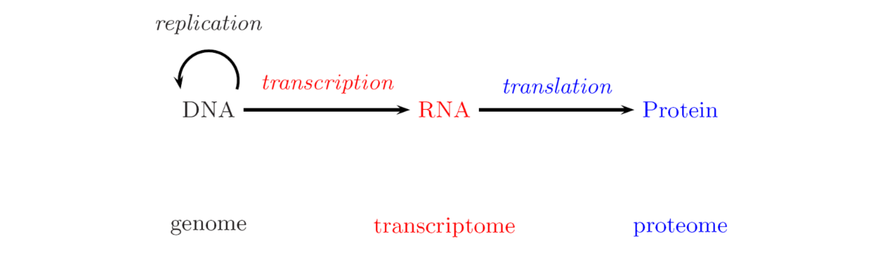

## Bioinformatics Notes, academic year 2021/2022

# Biological background 
## A quick introduction to Molecular Biology and Bioinformatics 

First of all, what is *Bioinformatics*?  as you can imagine, it's what you get when you combine Biology and informatics!  
Bioinformatics includes notions of computer science, but also chemistry, physics, information science/engineering, mathematics and statistics ...  
Keep in mind that computer science and information science are two different things.  

Information science is a field primarily concerned with: Analysis, classification, manipulation, storage, retrieval, transmission and obviously information.  
It is used for *in silico* analysis of biological data obtained from *in vivo* or *in vitro* sources.  

**A quick look at various types of Cells** 

  

### Molecules  

**Small Molecules** &rarr; Sources of energy, Building blocks for macromolecules or signaling molecules used for signal transmission. 

  

**Proteins** &rarr; Building blocks of the cell (and also of the organelles), functional molecules for biological processes. 
Usually they collaborate in "protein complexes" or have otherwise physical "protein-protein interactions".  

  

**An example of protein complex**  

  

### DNA and RNA  

**DNA**  
DNA (deoxyribonucleic acid) takes care of storage and reproduction of information.  
It contains genes, regulatory elements (e.g. "transcription factor binding elements") and "junk DNA" (regions without known function)  
It has a double stranded structure (double helix) 

  

**RNA**  

RNA (Ribonucleic acid) has a key role in transformation of genetic information to function  
It helps in constructing proteins (amino acid polymers) from genomic information stored in DNA. It has a single stranded structure.  

  

### Nucleotides  

The DNA and RNA is made up of nucleotides, each nucleotide is made up of one or mode phosphate group, a pentose sugar and a nitrogen-containing base.  
* DNA is made up of deoxyribose and 4 bases: Adenine (A), cytosine (C), guanine (G) and Thymine (T).  
* RNA is pretty much the same as DNA except for two differences: it has ribose instead of deoxyribose and Thymine is replaced by Uracil (U).  

### DNA molecules  

The DNA is a polymer (composed of monomers, the nucleotides), the phosphate group and the sugar constitute the backbone of the molecule, thus, the genetic information contained in the DNA is codified by a four-letter alphabet (A, C, T, G).  

  

The backbone is formed by covalent bonds: the phosphate group is attached to the 5' carbon of the sugar of one nucleotide is linked to the hydroxyl (OH) group of the 3' carbon of the sugar of the next nucleotide. 
**Single strand**: read from 5' to 3'  
**Double helix**: the two strands have the opposite orientation; A pairs with T and C pairs with G.  
The DNA is organized into chromosomes.  

### Reverse complement

Let's suppose we have the two following strands.

* **Positive** &rarr; *5'* A G T C A G T A A C T A G *3'*  
* **Negative** &rarr; *3'* T C A G T C A T T G A T C *5'*  This is the complementary to the positive strand. 
We can now invert the order of the complementary strand to obtain the *Reverse complementary to the positive strand* which, in our case, will be: 

**Reverse complementary** &rarr; *5'* C T A G T T A C T G A C T *3'*  

### DNA replication  

The DNA replication is done by reconstructing the opposite strand for each of the two separated original DNA strands. 

  

### Encoding and decoding of life  

Every living organism is encoded by one or more DNA molecules, that are continuously read and interpreted by its cells. 
Main questions: 
* *Where is the DNA located in the cell?*  
*Answer* &rarr; In prokaryotes it is "Free-floating" in the cytoplasm. Meanwhile, in eukaryotes, it is located in the cell nucleus (In the form of chromosomes).  
* *How much and what kind of information contains a living cell?*  
* *How is that infornmation encoded, stored, trasnmitted and decoded by DNA?*  

### The central dogma of molecular biology 

DNA stores the information that determines a protein's structure (It is transcribed into RNA).  
RNA mediates the information of genetic information into functional molecules (mRNA is translated into a protein).  
Proteins exert a biological function (which depends on the structure and the chemical properties).  
**NOTE** &rarr; This only holds for protein-coding genes, this is also a very simplified view.  

  

### Proteins  

Proteins are polypeptides (chains of individual amino acids).  
Basic amino acid structure &rarr; amino group (-NH3+), R group (carbon with side chain R), carboxyl group (-CO2-).  
The orientation of the amino acid chain is from "N-terminous" to "C-terminous".  

  

**Protein Functions**  

Proteins are involved in most of the tasks essential for life: 
* **Structural proteins** &rarr; building blocks of the cells. 
* **Receptor and channel proteins** &rarr; transmembrane proteins which can relay signals into the cell or shittle substances between compartments of the cell or the cell and the extracellular environment. 
* **Signaling proteins** &rarr; relay signals within the cell.  
* **Enzymes** &rarr; catalyze chemical reactions necessary for the energy metabolism.  
* **Transcription factors** &rarr; bind to DNA to control gene transcription.

### Transcription  

One strand of DNA is copied into a reverse complementary RNA molecule. 
* In prokaryotes (without nucleus) &rarr; mRNA  
* In eukaryotes (with nucleus) &rarr; Pre-mRNA  

DNA is copied into RNA by an RNA polymerase (usually RNA polymerase II).
Transcription's start is aided by transcription factors (TFs) bound on the *Promoter* of this gene.
Transcription's start can also be aided by TFs bound to a distant *Enhancer*.  

### RNA splicing 

In eukaryotic cells, transcripted RNA is often spliced before being exported from the nucleus to the cytoplasm.  
Let's now focus on **Introns** and **Exons**:  
* Introns (grey) &rarr; they are *spliced out* (biochemically removed). 
* Exons (green and red) &rarr; they remain to form the mature mRNA 
A protein coding RNA begins (5') and ends (3') with untrasnlated regions (UTRs). 
A 5′-cap and a 3′ poly-A tail are often added to the transcript.  

  

**Alternative splicing**  

Alternative splicing of transcripts allows to have different gene products from the same gene.  

  

### Translation (protein synthesis)  

mRNA transcripts are *translated* into proteins by the rybosome. 

 

The genetic code *codons* are nucleotide triples that encode amino acids.  
Translation starts at an AUG and ends with the first UAA, UAG, UGA.  

  

Each codon is recognized by a tRNA which carries the correct amino acid.  
In eukaryotes, transcription and translation happen in two different compartments, allowing for alternate splicing. This doesn't happen in prokaryotes.  

### How does the cellular system work?  

As you may already be able to tell, the cellular system is extremely complex.
If we want to know how it works we need to know everything about it. 
* How does gene transcription work?
* When are genes transcribed and at what level? (regulatory mechanisms) 
* When are transcripts degraded?
* How does protein synthesis work? What quantities of proteins are produced?
* How do specific molecules work (proteins, non-coding RNAs, ...)?
* How do specific molecules interact to exert a specific function?
* How are cellular processes intertwined and support or inhibit each other?
* How does the system dynamically change over time? How does the system change under certain conditions?
* How is it affected by disease (viruses, cancer, hereditary disorders, ...)?

### "-Omes" and "-Omics"  

The central dogma revisited:  

   

