## Bioinformatics Notes, academic year 2021/2022

# Biological background 
## A quick introduction to Molecular Biology and Bioinformatics 

First of all, what is *Bioinformatics*?  as you can imagine, it's what you get when you combine Biology and informatics!  
Bioinformatics includes notions of computer science, but also chemistry, physics, information science/engineering, mathematics and statistics ...  
Keep in mind that computer science and information science are two different things.  

Information science is a field primarily concerned with: Analysis, classification, manipulation, storage, retrieval, transmission and obviously information.  
It is used for *in silico* analysis of biological data obtained from *in vivo* or *in vitro* sources.  

**A quick look at various types of Cells** 

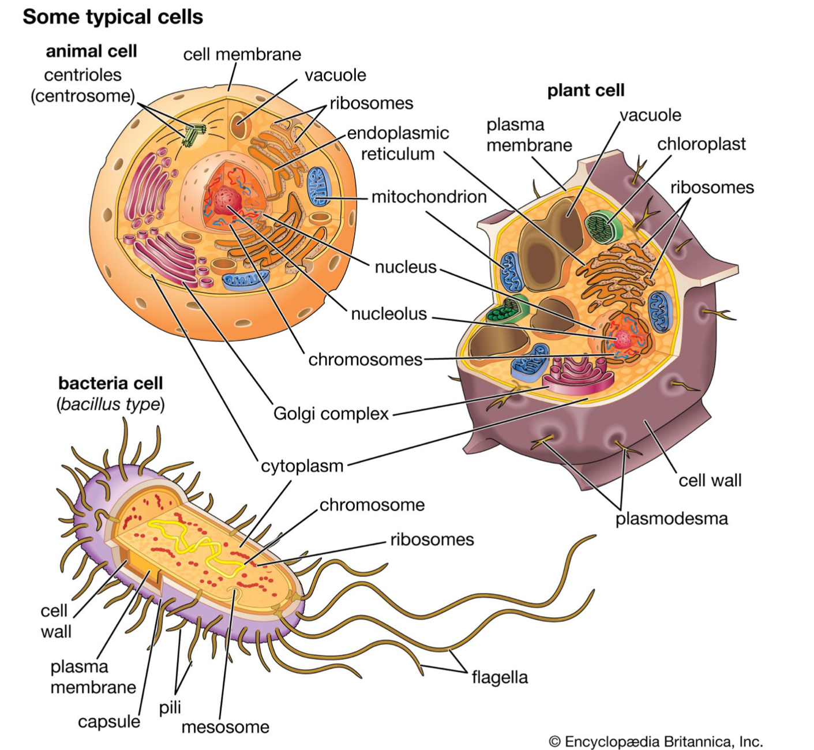  

### Molecules  

**Small Molecules** &rarr; Sources of energy, Building blocks for macromolecules or signaling molecules used for signal transmission. 

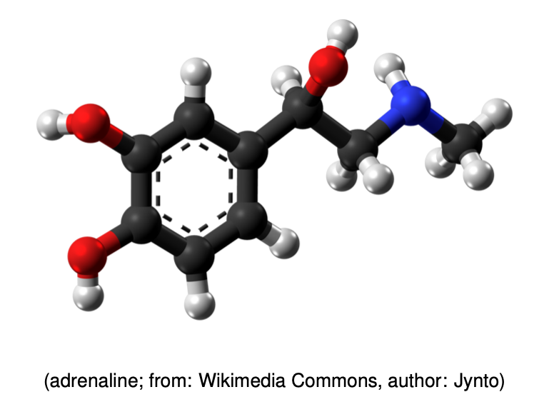  

**Proteins** &rarr; Building blocks of the cell (and also of the organelles), functional molecules for biological processes. 
Usually they collaborate in "protein complexes" or have otherwise physical "protein-protein interactions".  

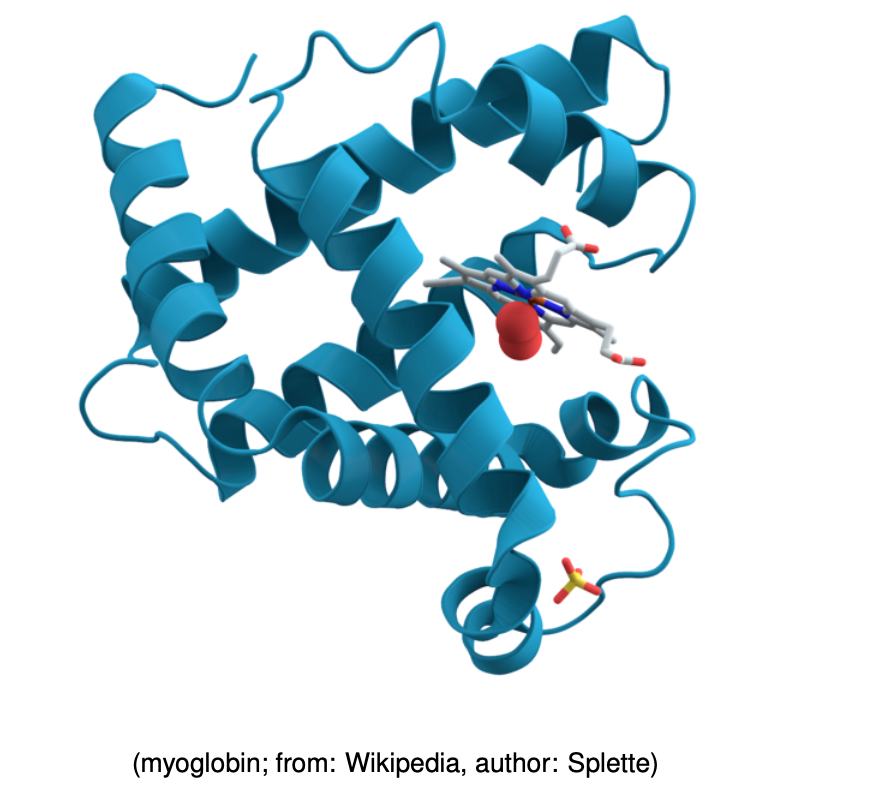  

**An example of protein complex**  

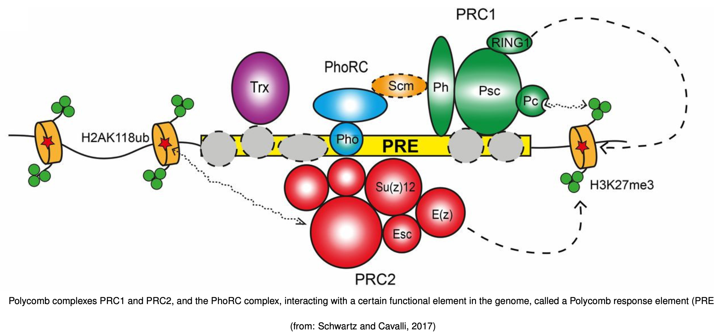  

### DNA and RNA  

**DNA**  
DNA (deoxyribonucleic acid) takes care of storage and reproduction of information.  
It contains genes, regulatory elements (e.g. "transcription factor binding elements") and "junk DNA" (regions without known function)  
It has a double stranded structure (double helix) 

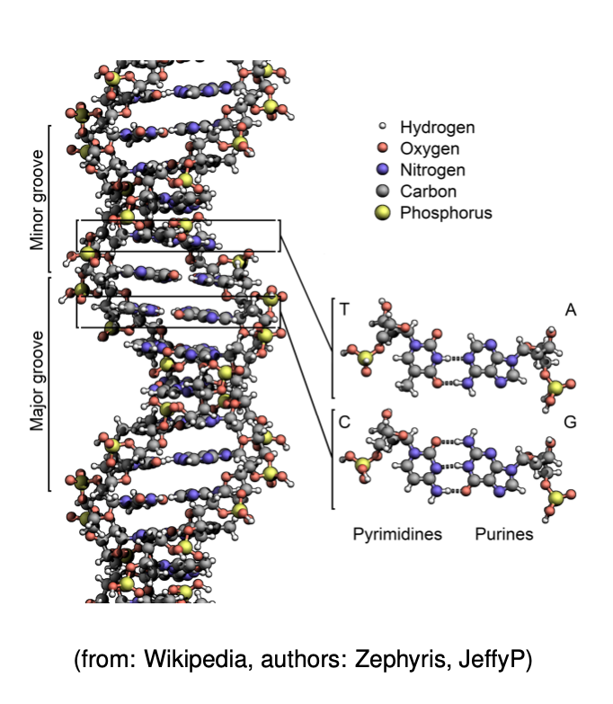  

**RNA**  

RNA (Ribonucleic acid) has a key role in transformation of genetic information to function  
It helps in constructing proteins (amino acid polymers) from genomic information stored in DNA. It has a single stranded structure.  

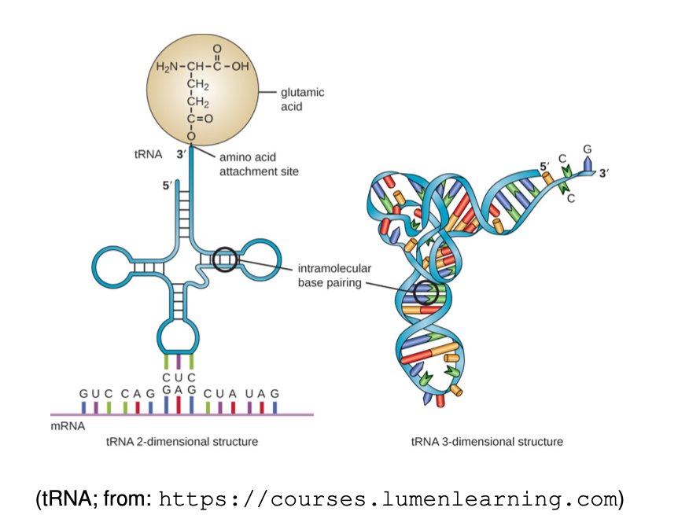  

### Nucleotides  

The DNA and RNA is made up of nucleotides, each nucleotide is made up of one or mode phosphate group, a pentose sugar and a nitrogen-containing base.  
* DNA is made up of deoxyribose and 4 bases: Adenine (A), cytosine (C), guanine (G) and Thymine (T).  
* RNA is pretty much the same as DNA except for two differences: it has ribose instead of deoxyribose and Thymine is replaced by Uracil (U).  

### DNA molecules  

The DNA is a polymer (composed of monomers, the nucleotides), the phosphate group and the sugar constitute the backbone of the molecule, thus, the genetic information contained in the DNA is codified by a four-letter alphabet (A, C, T, G).  

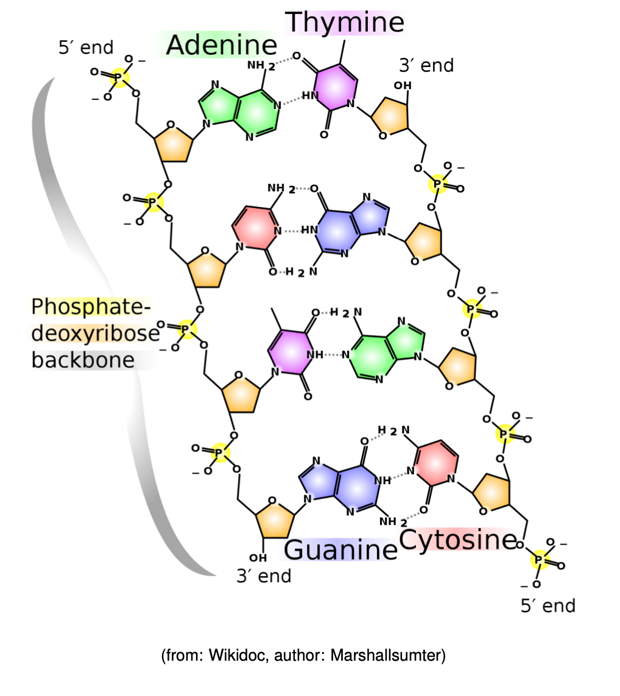  

The backbone is formed by covalent bonds: the phosphate group is attached to the 5' carbon of the sugar of one nucleotide is linked to the hydroxyl (OH) group of the 3' carbon of the sugar of the next nucleotide. 
**Single strand**: read from 5' to 3'  
**Double helix**: the two strands have the opposite orientation; A pairs with T and C pairs with G.  
The DNA is organized into chromosomes.  

### Reverse complement

Let's suppose we have the two following strands.

* **Positive** &rarr; *5'* A G T C A G T A A C T A G *3'*  
* **Negative** &rarr; *3'* T C A G T C A T T G A T C *5'*  This is the complementary to the positive strand. 
We can now invert the order of the complementary strand to obtain the *Reverse complementary to the positive strand* which, in our case, will be: 

**Reverse complementary** &rarr; *5'* C T A G T T A C T G A C T *3'*  

### DNA replication  

The DNA replication is done by reconstructing the opposite strand for each of the two separated original DNA strands. 

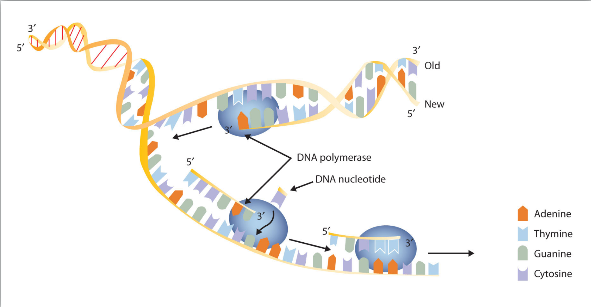  

### Encoding and decoding of life  

Every living organism is encoded by one or more DNA molecules, that are continuously read and interpreted by its cells. 
Main questions: 
* *Where is the DNA located in the cell?*  
*Answer* &rarr; In prokaryotes it is "Free-floating" in the cytoplasm. Meanwhile, in eukaryotes, it is located in the cell nucleus (In the form of chromosomes).  
* *How much and what kind of information contains a living cell?*  
* *How is that infornmation encoded, stored, trasnmitted and decoded by DNA?*  

### The central dogma of molecular biology 

DNA stores the information that determines a protein's structure (It is transcribed into RNA).  
RNA mediates the information of genetic information into functional molecules (mRNA is translated into a protein).  
Proteins exert a biological function (which depends on the structure and the chemical properties).  
**NOTE** &rarr; This only holds for protein-coding genes, this is also a very simplified view.  

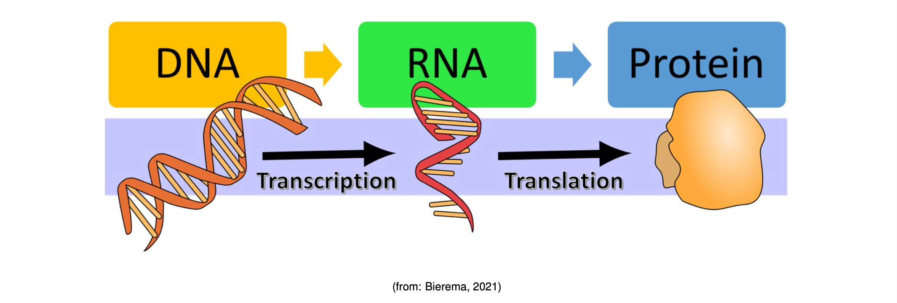  

### Proteins  

Proteins are polypeptides (chains of individual amino acids).  
Basic amino acid structure &rarr; amino group (-NH3+), R group (carbon with side chain R), carboxyl group (-CO2-).  
The orientation of the amino acid chain is from "N-terminous" to "C-terminous".  

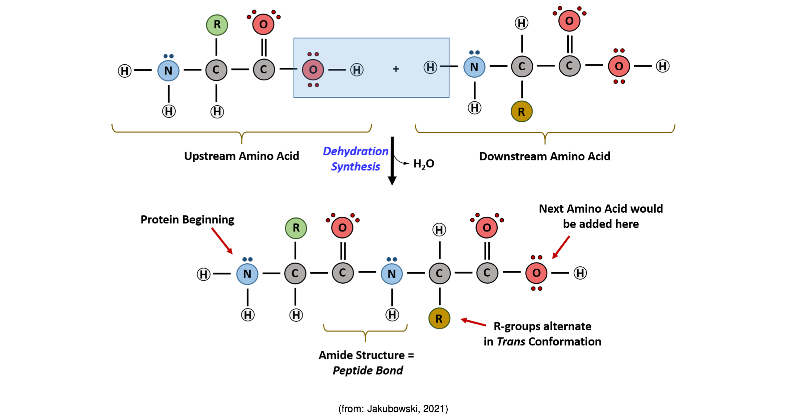  

**Protein Functions**  

Proteins are involved in most of the tasks essential for life: 
* **Structural proteins** &rarr; building blocks of the cells. 
* **Receptor and channel proteins** &rarr; transmembrane proteins which can relay signals into the cell or shittle substances between compartments of the cell or the cell and the extracellular environment. 
* **Signaling proteins** &rarr; relay signals within the cell.  
* **Enzymes** &rarr; catalyze chemical reactions necessary for the energy metabolism.  
* **Transcription factors** &rarr; bind to DNA to control gene transcription.

### Transcription  

One strand of DNA is copied into a reverse complementary RNA molecule. 
* In prokaryotes (without nucleus) &rarr; mRNA  
* In eukaryotes (with nucleus) &rarr; Pre-mRNA  

DNA is copied into RNA by an RNA polymerase (usually RNA polymerase II).
Transcription's start is aided by transcription factors (TFs) bound on the *Promoter* of this gene.
Transcription's start can also be aided by TFs bound to a distant *Enhancer*.  

### RNA splicing 

In eukaryotic cells, transcripted RNA is often spliced before being exported from the nucleus to the cytoplasm.  
Let's now focus on **Introns** and **Exons**:  
* Introns (grey) &rarr; they are *spliced out* (biochemically removed). 
* Exons (green and red) &rarr; they remain to form the mature mRNA 
A protein coding RNA begins (5') and ends (3') with untrasnlated regions (UTRs). 
A 5′-cap and a 3′ poly-A tail are often added to the transcript.  

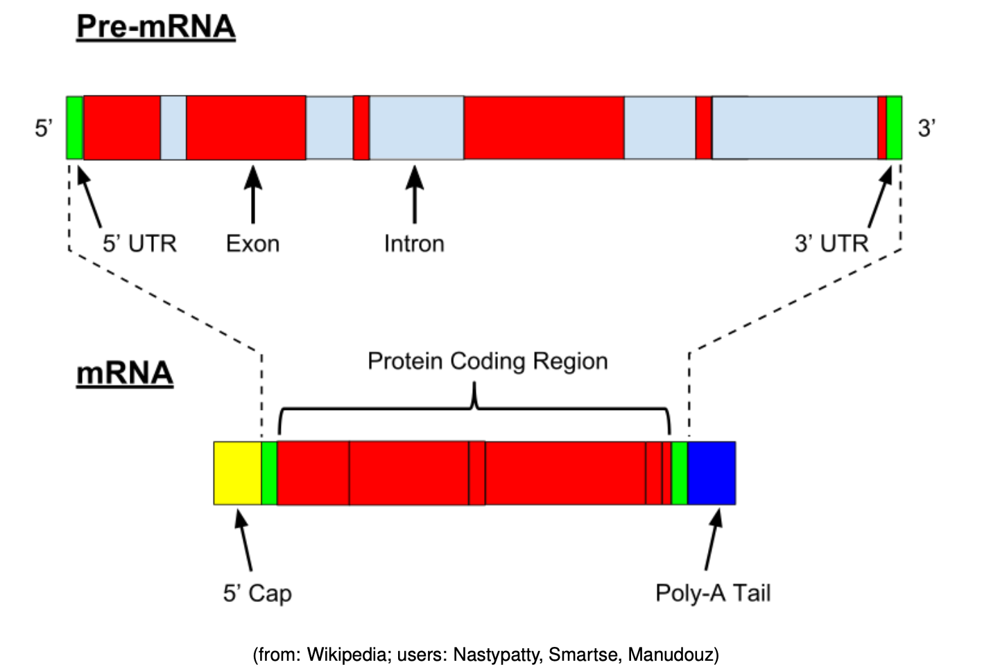  

**Alternative splicing**  

Alternative splicing of transcripts allows to have different gene products from the same gene.  

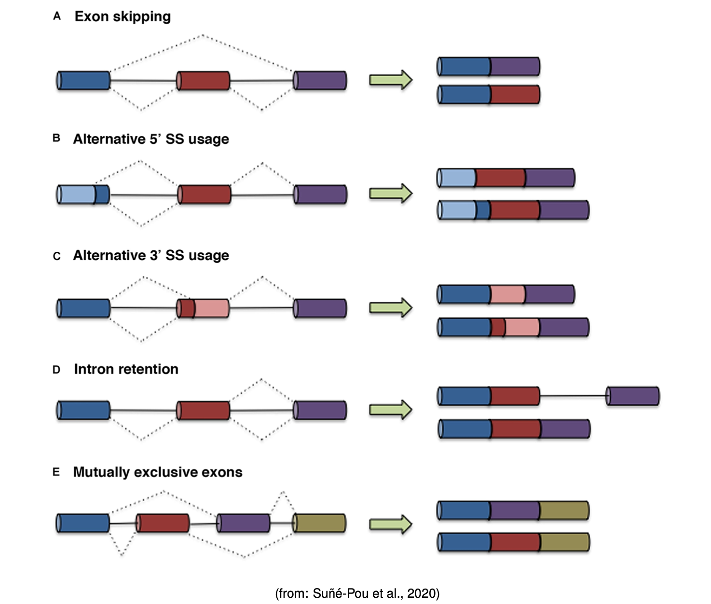  

### Translation (protein synthesis)  

mRNA transcripts are *translated* into proteins by the rybosome. 

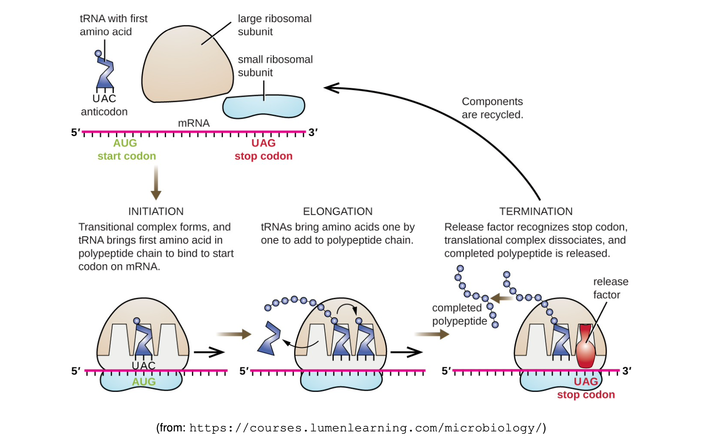 

The genetic code *codons* are nucleotide triples that encode amino acids.  
Translation starts at an AUG and ends with the first UAA, UAG, UGA.  

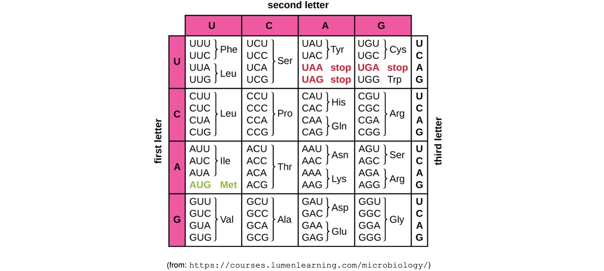  

Each codon is recognized by a tRNA which carries the correct amino acid.  
In eukaryotes, transcription and translation happen in two different compartments, allowing for alternate splicing. This doesn't happen in prokaryotes.  

### How does the cellular system work?  

As you may already be able to tell, the cellular system is extremely complex.
If we want to know how it works we need to know everything about it. 
* How does gene transcription work?
* When are genes transcribed and at what level? (regulatory mechanisms) 
* When are transcripts degraded?
* How does protein synthesis work? What quantities of proteins are produced?
* How do specific molecules work (proteins, non-coding RNAs, ...)?
* How do specific molecules interact to exert a specific function?
* How are cellular processes intertwined and support or inhibit each other?
* How does the system dynamically change over time? How does the system change under certain conditions?
* How is it affected by disease (viruses, cancer, hereditary disorders, ...)?

### "-Omes" and "-Omics"  

The central dogma revisited:  

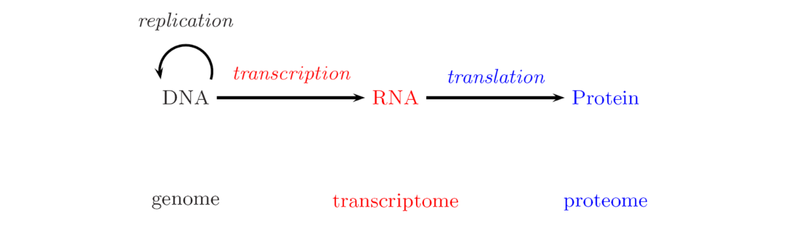   

"...Ome" is the complete set of: 
* Genome: Genes/Genetic material  
* Transcriptone: transcripts  
* Proteome: Proteins 
* Interactome: molecular interactions  
* Metabolome: chemicals involved in metabolic reactions 

"...Omics" is the study of: 
* (see everything above) by the means of high-throughput methods.  

## Sequencing 

### Sanger sequencing  

It's a sequencing method based on the synthesis of the complementary strand.  
Basic idea &rarr; start from single- stranded DNA, reconstruct the reverse strand (similar to DNA replication) and check which bases you have to add to reconstruct it!  
It's a classical chain-termination method.  
Ingredients: 
* single-stranded DNA template
* DNA primer
* DNA polymerase
* normal deoxynucleotide-triphosphates (dNTPs)
* “chain-terminating”, dideoxy NTPs (ddNTPs)

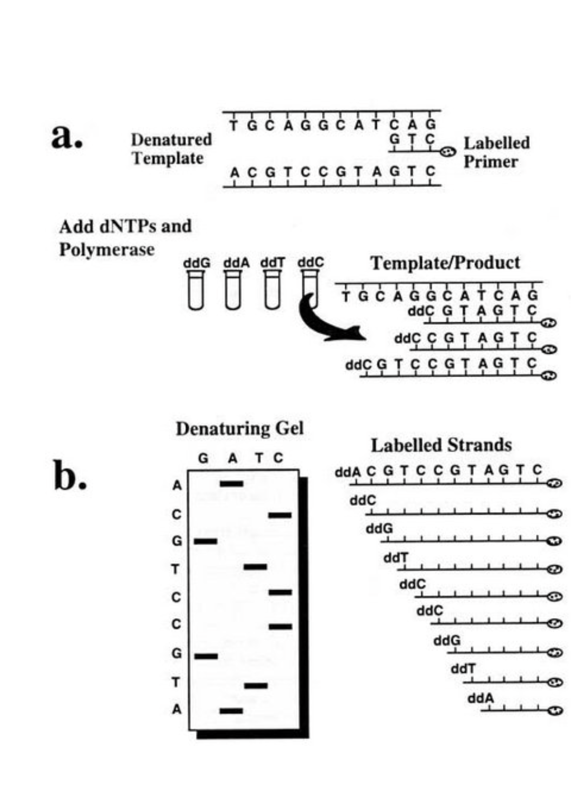  

**Tne key idea of Sanger sequencing: dideoxy nucleotides**  

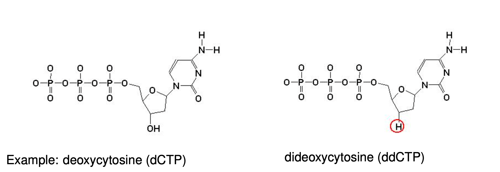  

A dideoxy nucleotide (ddNTP) stops DNA synthesis at specific nucleotides.  
For example, if the ddCTP to the right is incorporated into a growing strand of DNA, the lack of a free OH group at the 3′ carbon would prevent the next nucleotide from being added and thereby *terminate the chain extension!*. 
this type of sequencing was initially done with radioactively marked terminating nucleotides, e.g., ddATP–[α-33P]. 

### Next generation sequencing (NGS)  

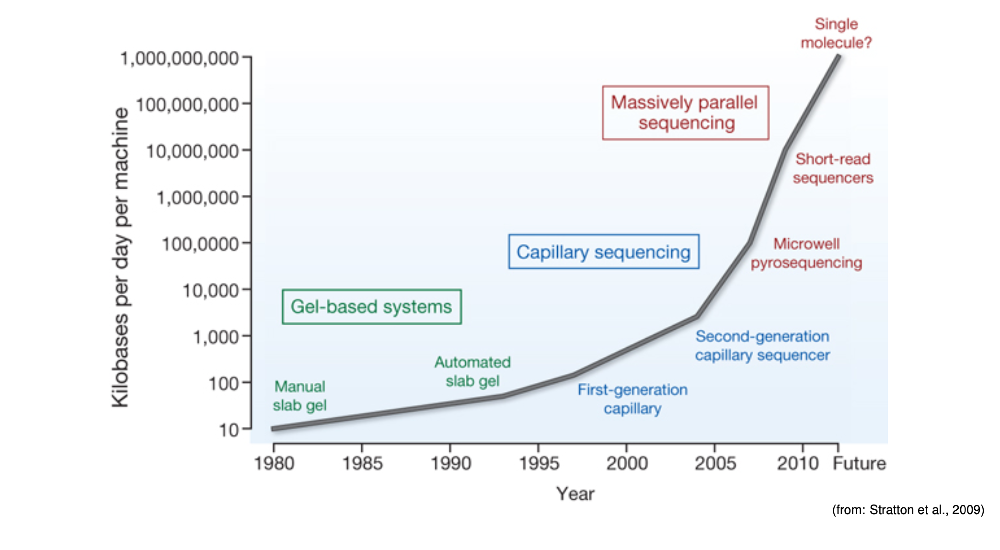  

the term "NGS" refers to one of a number of technologies that enable a massive parallelization of DNA sequencing; due to the extreme technology advantages, the cost of the whole-genome sequencing (WGS) has dropped significantly.  

### Illumina sequencing  

There have been multiple new generation sequencing technology, at present, the techonology of illumina seems to be far superior for most applications. 
It has four basic steps: 
* DNA and Library preparation &rarr; make random DNA fragments and happend adapters.  
* Chip/Flowcell prep &rarr; attach fragments to surface and amplify. 
* Sequence &rarr; Massively parallel DNA sequencing. 
* Analyze &rarr; Bioinformatics starts here. 

Understanding the first three steps is fundamental in order to understand the fourth one.  
* To be able to process error-prone biological data, it is important to know how such data is experimentally produced!  

**Library prep** 

Purpose of library prep &rarr; create a collection of DNA fragments ready to be sequenced.  
There are four major substeps for library prep (about 6 hours of lab work): 
* Fragment the genomic DNA (1)  
* Repair ends and add **A** overhang (2)  
* Ligate adapters to DNA fragments  (3)  
* Select ligated DNA  (4)  

Library prep (1): Fragmentation &rarr; Most Illumina protocols require that DNA is fragmented to less than 800 nt.  
Ideally fragments should have uniform size but in reality the follow a narrow distribution, or at least that's what we hope.  
Fragmentation can be done in multiple ways, for example: 
* Sonification &rarr; uses ultrasound waves in solution to shear DNA.
* Nebulization &rarr; forcing solution of genomic DNA to pass as a fine mist through a small hole in the nebulizer; repeatedly done. 

Library prep (2): End repair &rarr; : downstream enzymatic steps won’t work unless the DNA fragments are *nice!*  
After fragmentation, DNA fragments can have 5′- or 3′-overhangs which need to be repaired:  
* Reconstruct reverse strand at 5′ overhangs (DNA polymerase). 
* Cleave away 3′ overhangs (exonuclease) 
We also need to be sure that the phosphate (P) group isn’t missing at the 5′ ends.  
Moreover: A-tails (single adenine) are added for downstream steps: 
* Purpose: keep DNA fragments from ligating with each other & enable ligation to adaptors (which cleverly are designed to have a ’T’-base overhang)

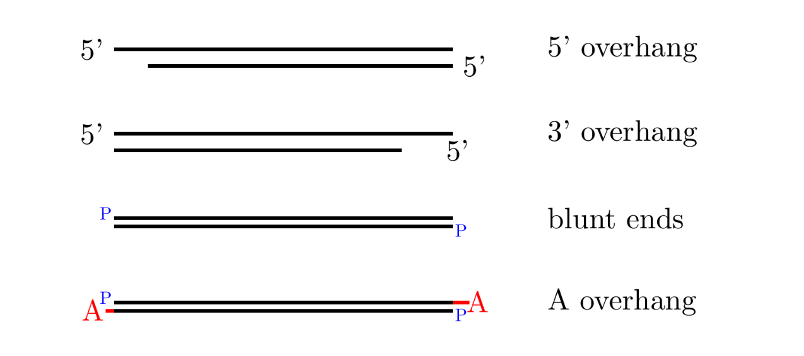

Library prep (3): Adapter ligation

Purpose of adapter ligation &rarr; adaptors get attached (ligated) to the end-repaired DNA fragments. this enables three things: 
* The adators will later bind to complementary oligonucleotides on the flowcell.  
* Allow PCR enrichment (amplification) of adapter-ligated DNA fragments only; not shown here... (PCR stands for polymerase chain reaction). 
* Allow for indexing or “barcoding” of samples (barcode shown as NNNNNN below).  

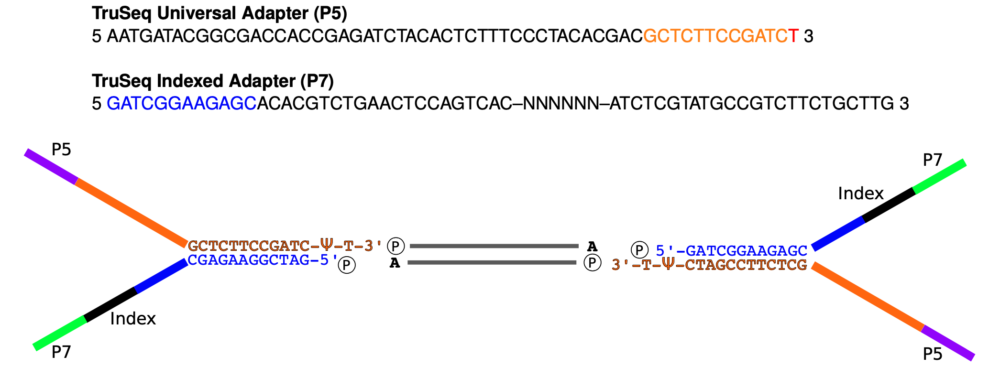

**Flow-cell prep**  

Purpose of Flowcell prep &rarr; Bind ligated DNA fragments to flow cell and perform in site amplification of individual molecules (creating clusters or “colonies”) to boost signal strength later during sequencing. 

Flow-cell prep (1): Library deposition  

* The double-stranded adapter-ligated DNA fragments are denatured with *NaOH*.  
* The single stranded DNA molecules are then transferred to the flowcell.  
* Here, they bind to oligonucleotides (“oligos”) attached to the flow cell surface; these oligos are designed to be reverse complementary to sequences in the adapters. 
* Extension mix (buffer, dNTP’s, Taq polymerase) is pumped into a channel. 
* The oligos on the flowcell are elongated using the ligated DNA fragments as a templates (reconstruction of the reverse strand of the DNA fragments to be sequenced) 
* We now get a double-stranded molecule.  
* Formamide is added to denature these products, and the original fragment (which is not covalently attached to the flowcell) is washed away. 
* The reconstructed reverse complement remains covalently fixed to the flowcell!  

Flow-cell prep (2): bridge amplification  

Purpose &rarr; Amplify single molecules attached to flowcell as described above by factors of ∼ 1000 to generate more signal in the following sequencing steps. 

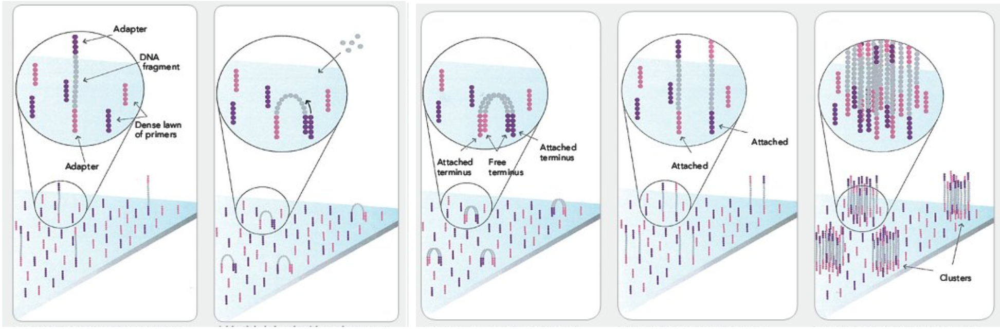  

* Single-stranded DNA molecule (1) bends and hybridizes to a second oligo on the flowcell surface (2). 
* Extension (reconstruction of reverse complementary strand) is performed all the way back to the other oligo: a “bridge” of double-stranded DNA (3). 
* Each strand of the bridge is covalently attached to a different oligo! (3). 
* Denaturation seperates the two strands, so that they again can bend and hybridize to another oligo (repeat from step 1, now with twice as many fragments!  
* This is repeated several times to create a cluster of copies of the original DNA fragment!  
* Finally: both strands are present; keep only fragments from one of the two strands, those of the reverse strand are cleaved away. 

### Sequencing by synthesis  

Sequencing by synthesis (SBS) is relatively easy to understand after all the preparation steps.  
Basic idea &rarr; reconstruct the reverse strand, but in each "cycle" add only one nucleotide and identify it.  
* Incorporate one base at a time using four differently marked ddNTPs (fluorescent dyes of different colors). 
* Difference to Sanger sequence: the ddNTPs have *reversible* terminators (reversible block of the 3′ OH group). 
* Identify which base was incorporated in each DNA fragment cluster by measuring the wavelength of the incorporated ddNTP. 
* Unblock the ddNTP (remove the terminator such that the sequence can be extended in the next cycle) and repeat!  

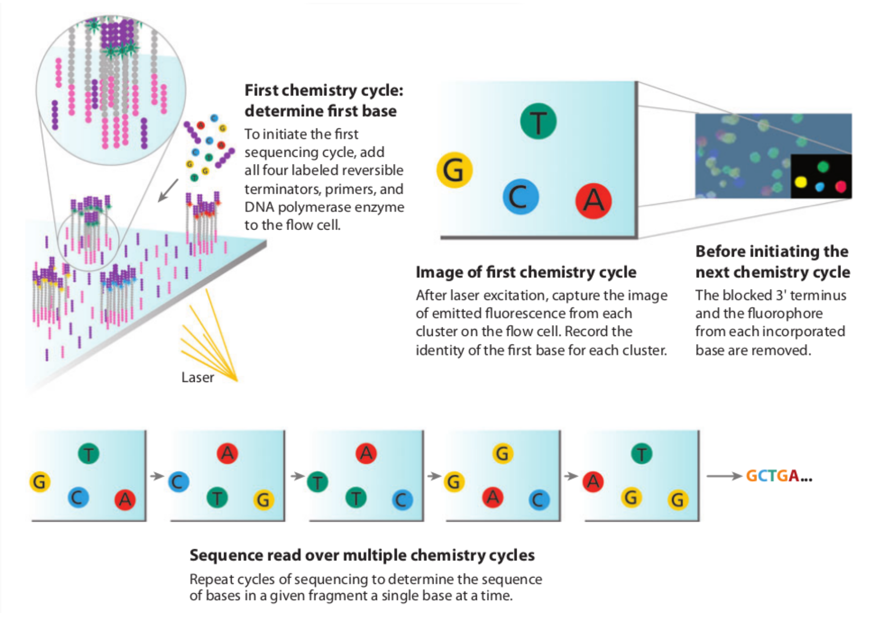  

* An imaging step follows each base incorporation step (we speak of one "cycle").   
* After each imaging step, the 3' blocking group is chemically removed and the cycle is repeated.  
* After having completed all cycles: 
A “base-calling” algorithm assigns sequences and associated quality values to each “read”. 
Read = the sequence of bases called from the colored images for one specific spot of the flow cell, corresponding to one specific DNA fragment!  
A quality checking pipeline removes poor-quality sequences. 

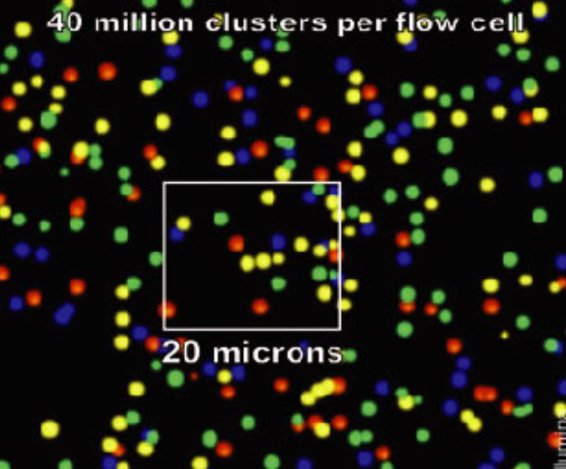  

### Nanopore sequencing  

A nanopore is a hole of around 1mm in diameter, then we apply voltage across pore and observe current due to conduction of ions through the nanopore. 
The different bases of DNA block the hole to different extents and change the current in a characteristic way.  

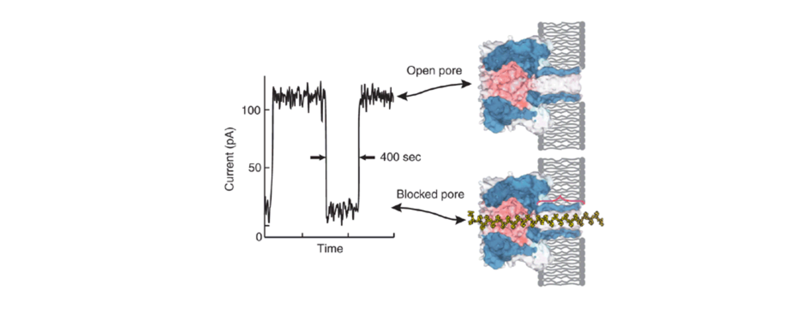  

* By following changes of current over time, we can determinate the sequence.  
* True single-molecule sequencing.  
* The advantages brought by this technique is that we can do really long reads and that it is really cheap. 
* Major disadvantage: higher error rates due to signal-to-noise issues inherent in the technology. 

# Genome assembly  

## Paired-end or single-end?  

The DNA fragments inserted between the adapters are usually longer than the maximum read (sequence) length. We can either sequence only one end of the fragment (“single-end sequencing”) or both ends (“paired-end sequencing”)!  

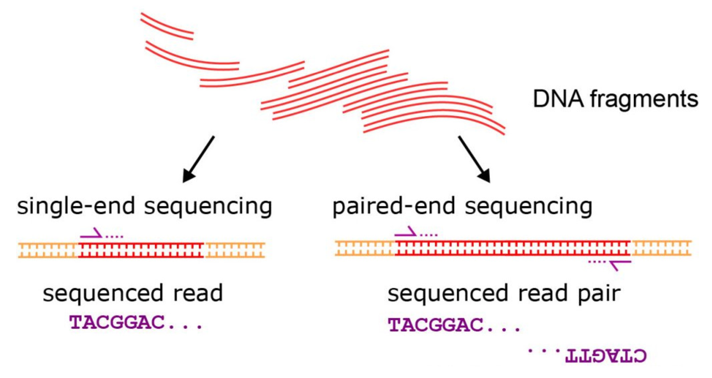  

### Paired-end sequencing  

What are the advantages of the Paired-end sequencing?  
* We know an approximate distance between the two reads (from the average fragment length)  
* Can help to identify structural variants  
In some cases, even if the Paired-end might be more precise, the Single-end sequencing will be enough to get the job done.  

## Genome assembly vs Read mapping  

**Genome assembly** &rarr; reconstruct the genome from (short) sequencing reads.  
**Read mapping** &rarr; Map (align) the reads to a known reference genome.  

### Genome assembly: the basics  

The process of puzzling together a complete genome sequence of an organism for which "shotgun sequencing" has been performed is referred to as *genome assembly*   
As the cost of sequencing has declined, the major challenge is strictly computational.  
There are two major classes of assembly algorithms: 
* Overlap-layout consensous (OLC). 
* De Bruijn graphs (DBG).  
OLC was widely used back in the day when sequencing was performed by the low-throughput, longer-read Sanger method. 
DBG-based methods have dominated the scene since the introduction of NGS. 

## Sequencing data: models and intuitions  

To get intuition about genome assembly, let us consider an **idealized genome** that represents a long random sequence of four bases and that does not contain repeats or other complex structures. 
* Consider a simple and error-free sequencing strategy:  
single-end, whole-genome sequencing (WGS); no sequencing errors. 
* That is, we sample equal-length fragments (the reads) with starting points randomly distributed across the genome. 
* Thus, our “shotgun” sequencing can be compared to a process that samples bases from all genome positions at random. 
* The chance that any particular base is sampled is very low in a single sampling process (a single read). 
However, we perform the sampling process a very large number of times (millions of reads!). 

 The Poisson distribution expresses the probability of a given number of events occurring in a fixed interval of time and/or space if these events are *iid* &rarr; (independent and identically distributed). 
 
 

* k refers to number of reads that overlap a certain genomic position (“coverage”). 
* λ = mean sequencing depth (average number of reads covering each base in the genome). 

*Let's look at this model a bit more closely...*  
* G: genome size (e.g., 3.2 × 109 bases for humans)
* L: read length (e.g., 100 bases for an older Illumina “run”) 
* N: number of reads
* nb: total number of sequenced bases

It is now easy to calculate that nb = N * L  
Similarly, the average coverage depth per base is λ = nb/G  

### K-mers  

K-mers are subsequences with K nucleotides, consider the following k-mers in a short read of 17 nucleotides...  

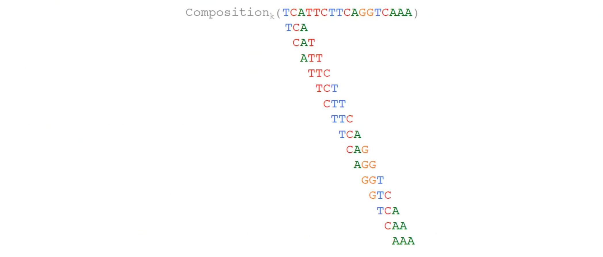 

